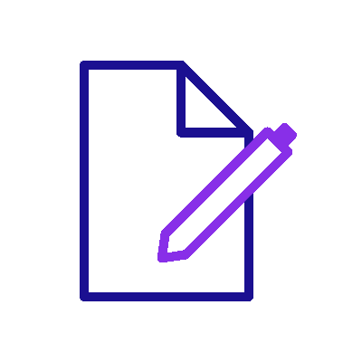
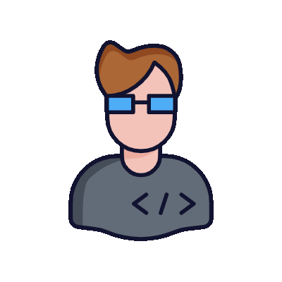

<!--
**AhmadIssa02/AhmadIssa02** is a ✨ _special_ ✨ repository because its `README.md` (this file) appears on your GitHub profile.

Here are some ideas to get you started:

- 🔭 I’m currently working on ...
- 🌱 I’m currently learning ...
- 👯 I’m looking to collaborate on ...
- 🤔 I’m looking for help with ...
- 💬 Ask me about ...
- 📫 How to reach me: ...
- 😄 Pronouns: ...
- ⚡ Fun fact: ...
-->
# Hello There!  

I am <strong>Ahmad Issa</strong>, a CS student, who is passionate about programming.

- I am currently learning Next.js and Nest.js.
# -  I am currently working on a website that teaches Arduino for kids with Ninjaco. 
-  I enjoy working on Data Structures and Algorithms in Java and Python.
-  I am passionate about data analytics.

# Tools and Languages 

<h3></h3>

 
 

  
  
  

<h3></h3>

 

  

<h3> - </h3>

 

  
  
 

<!-- 

<h3></h3>

 

 

 -->

<h3></h3>

 
 

# Socials 

   

# Github Achievements 

  

# Stats 
<!--  

  

 -->

   <table>
      <tr>
       <th>Profile stats  </th>
       <th>Language Contribution</th>
     </tr>
      <tr>
       <td> </td>
         <td> 
     </tr>
   </table>

<!-- 
<b>Top Repositories</b>

       
 -->
